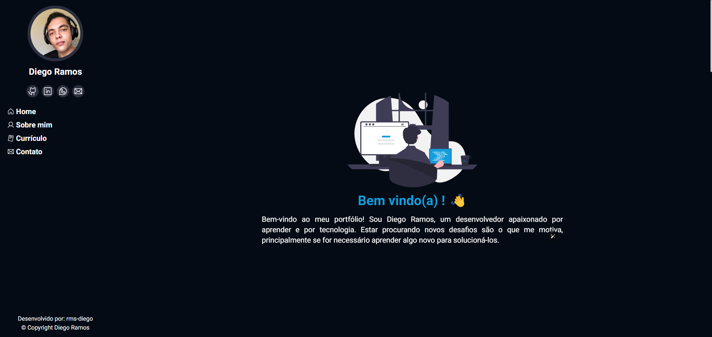

# Portfólio 📚

<!---Esses são exemplos. Veja https://shields.io para outras pessoas ou para personalizar este conjunto de escudos. Você pode querer incluir dependências, status do projeto e informações de licença aqui--->
<h1>
  Tecnologias 👨‍💻
   
   
  

    
    
    

  

</h1>

  

# Objetivo

Criar um site pessoal, para adicionar minhas experiencias de trabalho e meu desenvolvimento acadêmico
